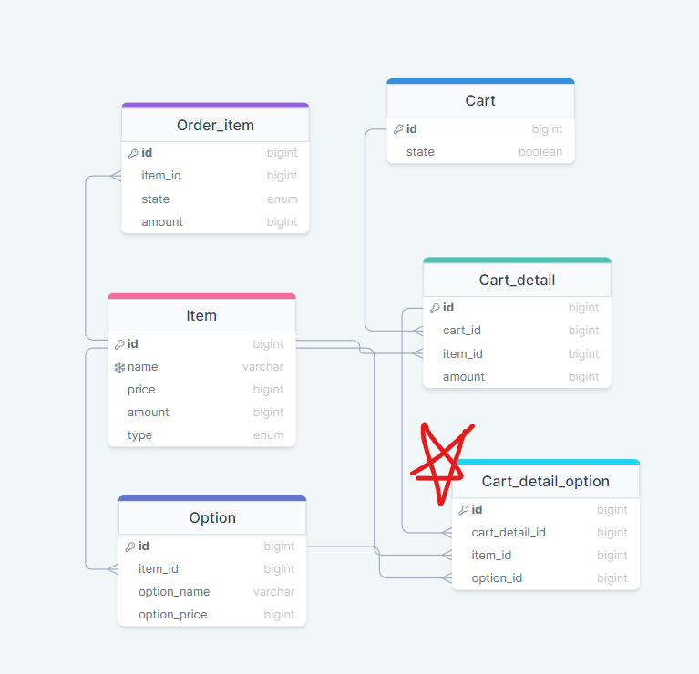

# 🛵Kiosk Project

## 프로젝트 목적

<aside>
💡 과제 목표: 제공된 데이터를 이용해 키오스크 기능을 가진 서버를 구현합니다.

- 손님들의 주문을 받아 가격이 있는 영수증을 발행합니다.
- DB로 상품의 재고 관리를 합니다.
- 서버 메모리 캐시로 데이터의 옵션을 관리합니다.
</aside>

## ERD

## API 명세

| Path                                | API Method | Verify |    Description     |
| ----------------------------------- | :--------: | :----: | :----------------: |
| /items                              |    POST    |        |      제품등록      |
| /items                              |    GET     |        |    제품전체조회    |
| /items/:type                        |    GET     |        |  타입별 제품 조회  |
| /items/:itemId                      |   DELETE   |        |      제품삭제      |
| /items/:itemId                      |   PATCH    |        |      제품수정      |
| /items/:itemId/option               |    POST    |        |      옵션등록      |
| /items/:itemId/option               |    GET     |        |      옵션조회      |
| /items/option/:optionId             |   PATCH    |        |      옵션수정      |
| /items/option/:optionId             |   DELETE   |        |      옵션삭제      |
| /order/item/:itemId                 |    GET     |        |   발주내용 조회    |
| /order/item/:itemId                 |    POST    |        |        발주        |
| /order/state/:orderId               |   PATCH    |        |    발주상태변경    |
| /cart                               |    POST    |        |   카트등록(시작)   |
| /cart/item/:itemId                  |    POST    |        |   상품카트에담기   |
| /cart/item/:itemId/option/:optionId |    POST    |        |    옵션추가하기    |
| /cart/item/:cartDetailId            |   DELETE   |        | 카트에담긴상품삭제 |
| /cart/item                          |    GET     |        |    장바구니조회    |
| /order/cart                         |   PATCH    |        |        주문        |
